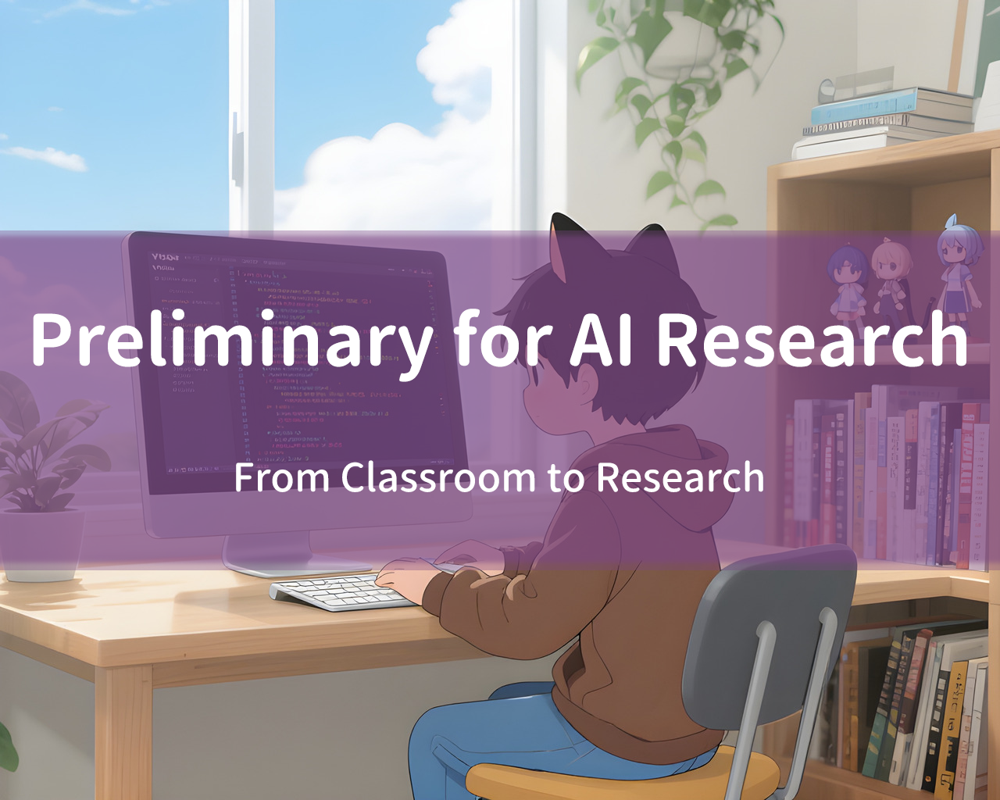

# 【新手友好】AI 科研常用知识

## 实践中常用的编程、深度学习、机器学习、数学

作者: Xi Wang (Hytidel)

版本 (最后更新): 2025.09.08

讲义: `course_notes.pdf`

视频教程: https://space.bilibili.com/382329676/lists/6307119?type=season

GitHub 仓库: https://github.com/Hytidel/preliminary_for_ai_research

---

